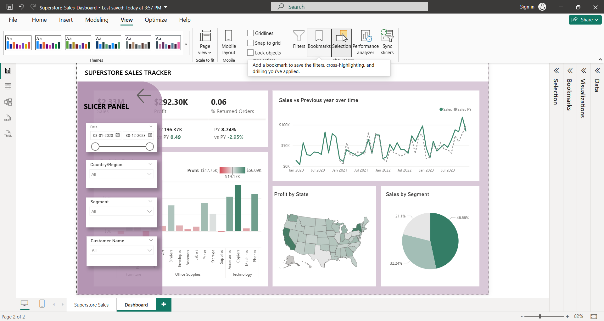

# powerbi_superstore_performance_dashboard
An interactive Power BI dashboard analyzing Superstore sales data to uncover key insights on revenue, profit, regional performance, and customer trends through dynamic visualizations.
---

📊 Superstore Sales Dashboard – Power BI

📌 Project Overview

This project presents an **interactive sales analytics dashboard** built using Power BI.
The dashboard analyzes Superstore sales data to uncover insights related to **revenue trends, profit performance, customer behavior, and regional sales distribution**.

The goal of this project is to transform raw data into "clear and actionable business insights using data visualization techniques."

---

📁 Dataset

The dataset used in this project contains information about:

* Orders
* Sales
* Profit
* Customer segments
* Product categories
* Regional performance

Dataset Source: Kaggle 
https://www.kaggle.com/datasets/bitricks/superstore-dataset

---

🛠 Tools & Technologies Used

* Power BI
* Data Visualization
* Data Cleaning
* Data Modeling
* DAX (Data Analysis Expressions)

---

📊 Dashboard Features

* Sales Performance Overview
* Profit Analysis
* Regional Sales Comparison
* Category & Sub-Category Insights
* Customer Segment Analysis
* Interactive Filters and Slicers

---
📸 Dashboard Preview
Dashboard Preview


---

🔍 Key Insights

* Identified top-performing product categories
* Analyzed regional sales and profit variations
* Highlighted high-value customer segments
* Tracked overall sales and profit trends

---

📂 Repository Contents

```
Superstore-PowerBI-Dashboard
│
├── Superstore_Dashboard.pbix
├── superstore_dataset.csv
├── dashboard_preview.png
└── README.md

---

🚀 How to Use

1. Download the **.pbix file**
2. Open it using **Power BI Desktop**
3. Explore the dashboard and interact with filters

---
